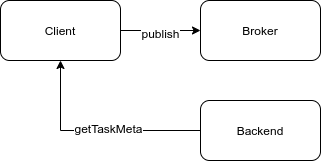

# Client


It is recommended to set configuration before use.
```javascript
const celery = require("celery-node");

const client = celery.createClient("amqp://", "amqp://");
// client.conf.BROKER_OPTIONS = {};
// client.conf.TASK_PROTOCOL = 1;

const task = client.createTask("tasks.add");
const result = task.applyAsync([1, 2]);
result.get().then(data => {
  console.log(data);
  client.disconnect();
});
```

### .createTask()
```javascript
createTask(name: string): Task
```
The function to define task.

### .sendTask()
```javascript
sendTask(taskName: string,
    args?: Array<any>,
    kwargs?: object,
    taskId?: string
  ): AsyncResult
```
You can send task directly without creating task.

```javascript
celeryClient.sendTask("tasks.add", [1, 2])
```


## Configuration

- BROKER_OPTIONS

Broker options of celery.node.  
Default value is `{}` (empty object).

More details on [Broker](guide/broker)
```javascript
cleint.conf.BROKER_OPTIONS = {}
```
- BACKEND_OPTIONS

Result backend options of celery.node.  
Default value is `{}` (empty object).

More details on [Backend](guide/backend)
```javascript
client.conf.BACKEND_OPTIONS = {}
```
- TASK_PROTOCOL

Celery protocol version.  
Default is `2`.

If you want to see more, check [here](internals/celery-protocol)
```javascript
client.conf.TASK_PROTOCOL = 2
```
